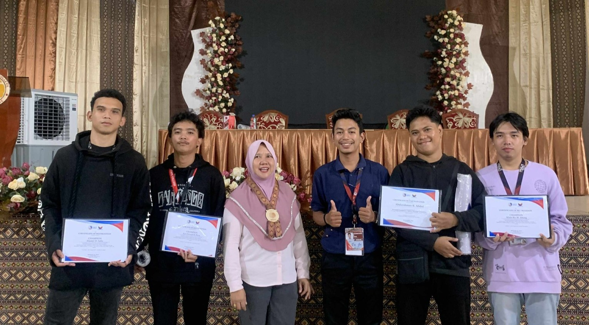
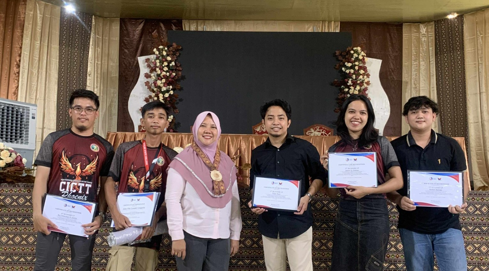

# 🏆 Basilan Provincial Hack4Gov CTF Competition 2025

> *"A full day of innovation, critical thinking, and cybersecurity excellence"*

## 🌐 About the Competition

The **Basilan Provincial Hack4Gov Capture-the-Flag (CTF) Competition 2025** was organized by:
- **Department of Information and Communications Technology (DICT) Region IX**
- **Provincial Office led by Mr. Micheal Jolo**

**Competition Highlights:**
- 🕒 Full-day cybersecurity challenge
- 🏫 8 teams from 3 institutions
- 🧠 Focused on real-world cybersecurity scenarios
- 🛡️ Promoted cyber defense strategies

## 🏫 Participating Institutions

| Institution | Teams |
|-------------|-------|
| Basilan State College (BaSC) | 2 Champion Teams |
| Furigay Colleges | Multiple Teams |
| Universal College | Multiple Teams |

## 🏆 Winning Teams

### 🥇 Provincial Champions - Team 1mpvl$3

**Members:**
- Abdurahman R. Abdul
- Klein Ric M. Abong
- Aljamri D. Solis
- Ace David B. Duja

**Mentor:**  
Mohammad Jeremy Intong

### 🥈 1st Place - Team Raze

**Members:**
- Janice Q. Juaban
- Rel Chrischan B. Jamiro
- John Fitz Gerald Gregorio
- Robert Barioga

**Mentor:**  
Adrian Vincent Avenido

## 🚀 Next Challenge
These winning teams will represent Basilan Province in the upcoming **Regional Hack4Gov Competition**.

## 🛡️ About Hack4Gov CTF
An annual initiative by:
- **Cybersecurity Bureau - DICT**
- **Philippine National Computer Emergency Response Team (NCERT/CERT-PH)**

**Objectives:**
- Promote cybersecurity awareness
- Provide practical defense experience
- Develop critical thinking skills
- Prepare students for real-world cyber threats

## 🏛️ Institutional Recognition

**Basilan State College**  
Proud home of both champion teams in this year's competition

## 📜 License
This project is open-source under the [MIT License](LICENSE).

---

  
  
  
© 2025 Basilan State College & DICT Region IX | All Rights Reserved

