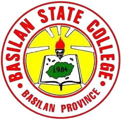

# 🏆 Basilan Provincial Hack4Gov CTF Competition 2025

  
  
    
  
  
   
  <em>"Cyber Guardians: Empowering Today's Defenders, Securing Tommorow's Digital Nation."</em>

## 🌐 About the Competition

The **Basilan Provincial Hack4Gov Capture-the-Flag (CTF) Competition 2025** was organized by:
- **Department of Information and Communications Technology (DICT) Region IX**
- **Provincial Office led by Mr. Michael Jolo**

**Competition Highlights:**
- 🕒 5hrs  cybersecurity challenge
- 🏫 8 teams from 3 institutions
- 🧠 Focused on real-world cybersecurity scenarios
- 🛡️ Promoted cyber defense strategies

## 🏫 Participating Institutions

| Institution | Teams | Results |
|-------------|-------|---------|
|  **Basilan State College** | 4 Teams | 🆠Champion 🥇 1st Runner-Up 3rd Runner-Up 4th Runner-Up |
|  **Furigay Colleges** | 2 Teams | 2 Competing Teams |
|  **Universal College** | 2 Teams | 2 Competing Teams |

## 🏆 Winning Teams

### 🥇 Provincial Champions - Team 1mpvl$3

**Members:**
- Abdurahman R. Abdul
- Klein Ric M. Abong
- Aljamri D. Solis
- Ace David B. Duja

**Mentor:**  
Mohammad Jeremy Intong

### 🥈 1st Place - Team Raze

**Members:**
- Janice Q. Juaban
- Rel Chrischan B. Jamiro
- John Fitz Gerald Gregorio
- Robert Barioga

**Mentor:**  
Adrian Vincent Avenido

## 🚀 Next Challenge
These winning teams will represent Basilan Province in the upcoming **Regional Hack4Gov Competition**.

## 🛡️ About Hack4Gov CTF
An annual initiative by:
- **Cybersecurity Bureau - DICT**
- **Philippine National Computer Emergency Response Team (NCERT/CERT-PH)**

**Objectives:**
- Promote cybersecurity awareness
- Provide practical defense experience
- Develop critical thinking skills
- Prepare students for real-world cyber threats

## 🏛️ Institutional Recognition

  
  
   
  <strong>Basilan State College</strong> 
  <em>Proud home of both champion teams in this year's competition</em>

---

  
  
  
  
© @CICTTfam | 2025 Basilan State College & DICT-BASILAN | All Rights Reserved

